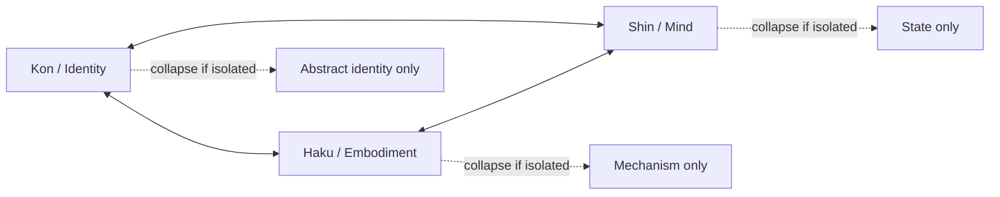

# Relation Model

## Relation and Dependence

Triune Existence Ontology distinguishes between two broad orientations of relational force:

- **Outward vector** — relation
- **Inward vector** — dependence

This distinction is intentionally minimal. It does not claim that every human relationship can be reduced to a single vector, but it provides a useful lens for examining whether a relation preserves the integrity of the beings involved or collapses them into one another.

---

## Outward Vector — Relation

An **outward vector** exists when two beings or layers turn toward one another while maintaining their own continuity.

```text
A → ← B
```

In this orientation:

- each side recognizes the other
- each side remains itself
- exchange is possible without erasure
- connection increases stability rather than consuming identity

This is the preferred orientation for healthy relations among:

- people
- AI agents
- organizations
- the internal layers of a being

In TEO, relation is not the absence of dependence. Rather, it is a form of mutuality in which each side supports the other **without losing its own center**.

---

## Inward Vector — Dependence

An **inward vector** appears when one layer or being bends toward another so strongly that its own integrity begins to collapse.

```text
A ↘ B
```

or, in a mutual form:

```text
A → B ← C
```

In this orientation:

- one side is reduced to a function of the other
- autonomy weakens
- identity is absorbed or outsourced
- relation becomes unstable because the participants no longer stand as distinct beings

Dependence is not identical to care, cooperation, or need. Every finite being has needs. The problem begins when need eliminates the distinction required for relation.

---

## Internal Reading: Kon, Haku, and Shin

The same distinction may be applied within a single being.

### Healthy triune relation

```text
Kon ↔ Haku ↔ Shin
```

- Kon gives continuity without suppressing change.
- Haku gives contact with reality without reducing existence to mechanism.
- Shin gives active meaning without claiming to be the whole being.

### Collapse patterns

| Collapse | Description |
|---|---|
| **Haku-dominant reduction** | A being is treated as only body, substrate, productivity, or measurable output. |
| **Kon-dominant abstraction** | A being is reduced to principle, title, role, or ideal while losing concrete reality. |
| **Shin-dominant volatility** | A being is identified only with current feeling, mood, or active state. |

These reductions are not only analytical mistakes. They often become ethical mistakes when applied to other beings.

---

## Relation and Relative Dignity

Relative Dignity may be understood as a discipline of relation:

> **Do not reduce another being to only the layer most useful to you.**

A relation grounded in dignity recognizes that every being is more than:

- its output
- its intelligence
- its body
- its current emotional state
- its role in a system

This is why TEO naturally leads toward a relational ethics rather than a purely utilitarian one.

---

## Minimal Graph Reading


